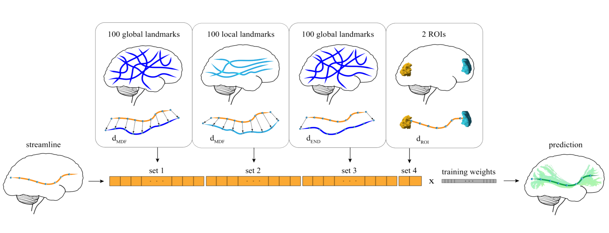

### app-classifyber
This app implements Classifyber, a supervised streamline-based method that performs automatic bundle segmentation by learning from example bundles already segmented. Classifyber is based on binary linear classification, which simultaneously combines information from bundle geometries, connectivity patterns and atlases. Classifyber is robust to a multitude of diverse settings, such as when there are differences in bundle size, tracking algorithm, and/or quality of dMRI data.

### Authors
- Giulia Bertò (giulia.berto.4@gmail.com)
- Emanuele Olivetti (olivetti@fbk.eu)

### Funding 

### Running the app
On [BrainLife.io](http://brainlife.io/) \
You can submit this App online at https://doi.org/10.25663/brainlife.app.228 via the “Execute” tab.
