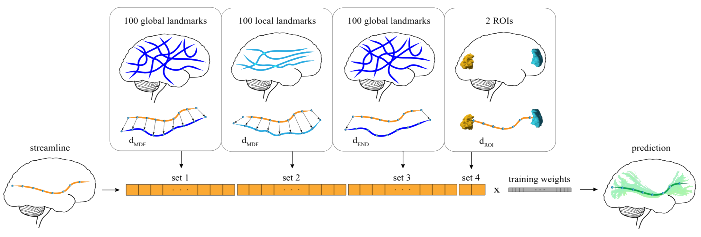

[](https://doi.org/10.25663/brainlife.app.228)

# app-classifyber
This App implements both the TRAINING and TEST PHASES of Classifyber, a supervised streamline-based method that performs automatic bundle segmentation by learning from example bundles already segmented. Classifyber is based on binary linear classification, which simultaneously combines information from bundle geometries, connectivity patterns, and atlases. In addition, it is robust to a multitude of diverse settings, i.e. it can deal with different bundle sizes, tracking algorithms, and dMRI data qualities.



If you want to run only the TEST PHASE, please refer to the App https://doi.org/10.25663/brainlife.app.265.

### Authors
- Giulia Bertò (giulia.berto.4@gmail.com)

### Contributors
- Emanuele Olivetti (olivetti@fbk.eu)

### Funding Acknowledgement
We kindly ask that you acknowledge the funding below in your publications and code reusing this code. \
[](https://nsf.gov/awardsearch/showAward?AWD_ID=1734853)
[](https://nsf.gov/awardsearch/showAward?AWD_ID=1636893)
[](https://nsf.gov/awardsearch/showAward?AWD_ID=1916518)

### Citation
We kindly ask that you cite the following article when publishing papers and code using this code: \
["Classifyber, a robust streamline-based linear classifier for white matter bundle segmentation"](https://doi.org/10.1016/j.neuroimage.2020.117402), Bertò, G., Bullock, D., Astolfi, P., Hayashi, S., Zigiotto, L., Annicchiarico, L., Corsini, F., De Benedictis, A., Sarubbo, S., Pestilli, F., Avesani, P., Olivetti, E. NeuroImage (2020).

## Running the app
### On [Brainlife.io](http://brainlife.io/)
You can submit this App online at https://doi.org/10.25663/brainlife.app.228 via the “Execute” tab.

Inputs: \
To perform the bundle segmentation, you need two key elements: (i) the tractogram of the (target) subject you want to extract the bundle from and (ii) the wmc segmentations of multiple (example) subjects you want to learn from. Moreover, you have to provide the anatomical T1s and the tractograms of the (example) subjects (which are used to compute bundle superset and internal conversions). WARNING: all the tractograms need to be already co-registered in the same anatomical space (you can use the App https://doi.org/10.25663/brainlife.app.202 to warp your .tck file to the MNI152 T1 space). 

Output: \
You will get the wmc segmentation of the bundle(s) of interest in the target subject. You can convert it in multiple .tck files with the App https://doi.org/10.25663/brainlife.app.251.

#### Branch 1.0:
The wmc segmentation files you have to provide as examples should be obtained using the AFQ segmentation algorithm (https://doi.org/10.25663/brainlife.app.207) or the WMA segmentation algorithm (https://doi.org/10.25663/brainlife.app.188). 

In the first case, you can choose the bundle(s) to be segmented by providing the id(s) related to the AFQ segmentation as follows: \
1 - Left Thalamic Radiation \
2 - Right Thalamic Radiation \
3 - Left Corticospinal \
4 - Right Corticospinal \
5 - Left Cingulum Cingulate \
6 - Right Cingulum Cingulate \
7 - Left Cingulum Hippocampus \
8 - Right Cingulum Hippocampus \
9 - Callosum Forceps Major \
10 - Callosum Forceps Minor \
11 - Left IFOF \
12 - Right IFOF \
13 - Left ILF \
14 - Right ILF \
15 - Left SLF \
16 - Right SLF \
17 - Left Uncinate \
18 - Right Uncinate \
19 - Left Arcuate \
20 - Right Arcuate 

In the second case, you can choose the bundle(s) to be segmented by providing the id(s) related to the WMA segmentation as follows: \
38 - Left pArc \
39 - Right pArc \
40 - Left TP-SPL \
41 - Right TP-SPL \
42 - Left MdLF-SPL \
43 - Right MdLF-SPL \
44 - Left MdLF-Ang \
45 - Right MdLF-Ang 

### Running locally
1. git clone this repo.
2. Inside the cloned directory, create `config.json` with something like the following content with paths to your input files:
```
{
    "tractogram_static": "./track.tck",
    "t1_static": "./t1.nii.gz",
    "segmentations": [
        "./sub-1/classification.mat",           
        "./sub-2/classification.mat"
    ],
    "tracts": [
        "./sub-1/tracts",
        "./sub-2/tracts"
    ],
    "tractograms_moving": [
        "./sub-1/track.tck",
        "./sub-2/track.tck"
    ],
    "t1s_moving": [
        "./sub-1/t1.nii.gz",
        "./sub-2/t1.nii.gz"
    ],
    "tractID_list": "11, 12, 19, 20"
}
```
3. Launch the App by executing `main`.
```
./main
```

#### Dependencies
This App only requires [singularity](https://sylabs.io/singularity/) to run.

#### MIT Copyright (c) 2020 Bruno Kessler Foundation (FBK)

